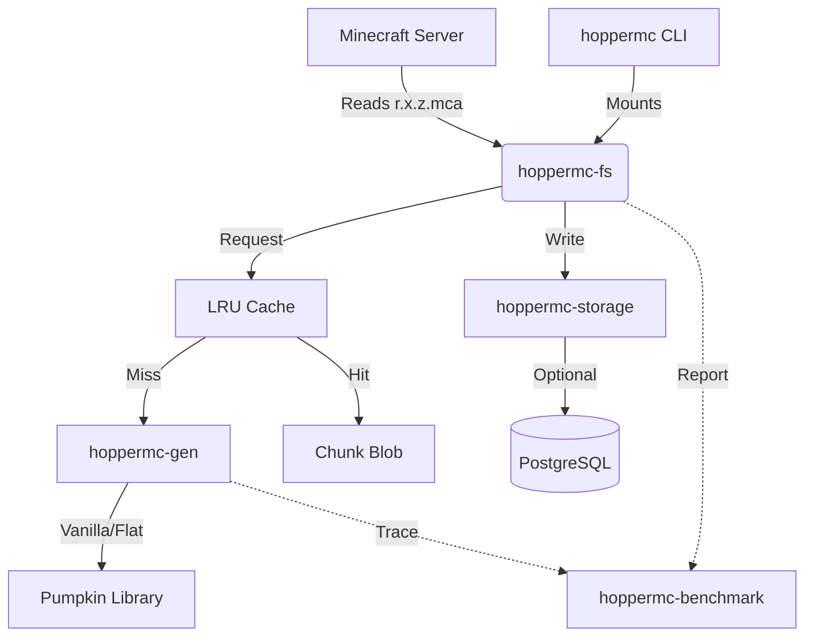

# HopperMC Code Structure

This document outlines the architecture, crates, and key implementation details of the HopperMC codebase.

## High-Level Architecture

HopperMC is designed as a **virtual filesystem** that generates Minecraft chunks on-the-fly. It sits between the Minecraft Server and the storage disk.



---

## Crates Overview

The project is a workspace divided into 6 crates:

### 1. `hoppermc-benchmark` (Metrics)
**Role**: Centralized metrics collection.
**Key Types**: `BenchmarkMetrics`.
- Uses `AtomicU64`/`AtomicUsize` for thread-safe counting without locks.
- Tracks:
    - **Generation Logic**: Granular breakdown of `Biomes`, `Noise` (terrain), `Surface`, and `Conversion`.
    - **World Weight**: Tracks actual PostgreSQL table size and compares it with an estimated MCA file size (Efficiency metric).
    - **Filesystem (FUSE)**: Tracks `read_at` Latency, Throughput (MB/s), and Compression Ratios.
    - **I/O**: Cache Hits/Misses, Serialization, Compression.
- **Reporting**: Prints a detailed summary to `benchmarks/` on shutdown.

### 2. `hoppermc-anvil` (Format Utilities)
**Role**: Constants and helpers for the Anvil file format.
- Contains compression scheme constants (GZIP, ZLIB, LZ4).
- Defines region header sizes (4096 bytes).

### 3. `hoppermc-storage` (Persistence)
**Role**: Abstraction layer for saving/loading chunk data.
**Key Traits**: `Storage`.
- **`PostgresStorage`**: Implementation that saves chunks to a PostgreSQL database (`chunks` table).
- **`NoStorage`**: Dummy implementation that discards writes (stateless mode).
- Handles compression/decompression during save/load.

### 4. `hoppermc-gen` (World Generation)
**Role**: Generates NBT chunk data from scratch.
**Key Traits**: `WorldGenerator`.

#### Implementations:
1.  **`VanillaWorldGenerator`**:
    - Wraps `pumpkin-world`.
    - **Pipeline**:
        1.  **Biomes**: Generates 3D biome grid.
        2.  **Noise**: Generates terrain height/density (Perlin/Simplex).
        3.  **Surface**: Replaces stone with Grass/Sand/Snow.
        4.  **Conversion**: Transforms `ProtoChunk` -> `ChunkData`.
    - Uses **Rayon** to parallelize final block and biome conversion loops across all cores.
    - Heavy on CPU (uses SIMD if enabled).

2.  **`FlatGenerator`**:
    - Simple flat world (Bedrock + Dirt + Grass).
    - Uses `ChunkBuilder` helper.

#### `builder.rs`:
- `ChunkBuilder`: A simplified API to construct Pumpkin `ChunkData` programmatically (used by Flat generator).

### 5. `hoppermc-fs` (Filesystem Core)
**Role**: Implements the FUSE interface (Filesystem in Userspace).
**Key Types**: `VirtualFile`.

#### Logic Flow (`virtual_file.rs`):
1.  **Mount**: Exposes a directory containing virtual `.mca` files.
2.  **`open`**: Intercepts file open.
3.  **`read_at(offset, size)`**:
    - Calculates **Chunk Coordinates (X, Z)** based on file offset. (Minecraft treats .mca as a contiguous array of 4KB sectors).
    - **Input**: `r.0.0.mca` offset `8192` -> Chunk (0, 0).
    - Checks **LRU Cache**.
    - If miss: Calls `generator.generate_chunk()`.
    - Compresses resultant NBT.
    - **Prefetch Radius**: If enabled, spawns concurrent background tasks to warm up neighbors of the requested chunk.
    - Records **FUSE Metrics** (Latency, Size).
    - Returns byte slice to Minecraft.
4.  **`write_at`**:
    - Intercepts chunk saves.
    - Parses NBT headers to find true coordinates (Minecraft sometimes writes to "wrong" offsets).
    - Sends data to `hoppermc-storage`.

#### `inode.rs`:
- Implements **Coordinate Packing**:
    - Maps 2D chunk coordinates (X, Z) into a unique 64-bit Inode ID.
    - Ensures consistent file handles across the OS.

### 6. `hoppermc` (CLI Glue)
**Role**: Entry point.
- Parses command line args (`--generator`, `--postgres-url`, etc.).
- Initializes `env_logger`.
- Creates `tokio::runtime` (global).
- Mounts the FUSE filesystem using `fuser` crate.
- Handles `CTRL+C` shutdown and triggers benchmark report.

---

## Key Data Flows

### Chunk Generation Request
```
Minecraft -> read(r.0.0.mca, offset=8192)
    -> hoppermc-fs::VirtualFile::read_at
        -> Calculate Chunk(0,0)
        -> Check LRU Cache (Miss)
        -> hoppermc-gen::VanillaWorldGenerator::generate_chunk
            -> Pumpkin: Noise -> Biomes -> Surface
            -> Serialize to NBT
        -> Compress (Zlib)
        -> Compress (Zlib)
        -> Store in Cache
        -> Record Benchmark (Latency/Size)
    -> Return Bytes
```

### Chunk Save Request
```
Minecraft -> write(r.0.0.mca, offset=...)
    -> hoppermc-fs::VirtualFile::write_at
        -> Extract NBT Headers (Get real X,Z)
        -> hoppermc-storage::PostgresStorage::save_chunk
            -> INSERT INTO chunks ...
```
